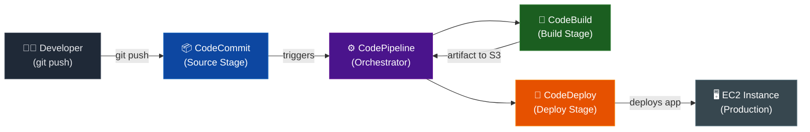

# CI/CD Architecture Diagram

## Pipeline Flow



## Service Roles

| Service | Role | Key File |
|---------|------|----------|
| **CodeCommit** | Git repository — source of truth, pipeline trigger | — |
| **CodePipeline** | Orchestrates stages, passes artifacts between them | Pipeline config |
| **CodeBuild** | Compiles code, runs tests, produces deployment artifact | `buildspec.yml` |
| **CodeDeploy** | Copies artifact to EC2, runs lifecycle hooks | `appspec.yml` |
| **EC2** | Runs the application (Apache serving index.html) | — |

## Artifact Flow

```
CodeCommit repo
  └── buildspec.yml        ← tells CodeBuild what to do
  └── appspec.yml          ← tells CodeDeploy how to deploy
  └── scripts/             ← lifecycle hook scripts
  └── app/index.html       ← the application

CodeBuild packages → uploads artifact .zip to S3

CodeDeploy downloads artifact from S3 → deploys to EC2
```
