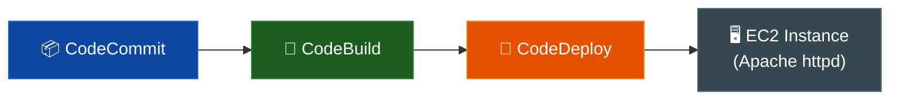
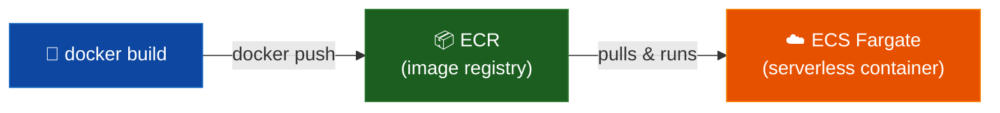

# Containers on AWS — Architecture Diagram

## Container Deployment Flow

```mermaid
flowchart LR
    Dev["👨‍💻 Developer\n(docker build)"]
    Docker["🐳 Docker Image\n(local)"]
    ECR["📦 Amazon ECR\n(Registry)"]
    ECS["⚙️ Amazon ECS\n(Orchestrator)"]
    Fargate["☁️ Fargate Task\n(Container)"]
    Browser["🌐 Browser\n(Public IP)"]

    Dev -->|docker build| Docker
    Docker -->|docker push| ECR
    ECR -->|pulls image| ECS
    ECS -->|runs task| Fargate
    Fargate -->|port 80| Browser

    style Dev fill:#1f2937,color:#e5e7eb,stroke:#374151
    style Docker fill:#0d47a1,color:#fff,stroke:#1565c0
    style ECR fill:#1b5e20,color:#fff,stroke:#2e7d32
    style ECS fill:#4a148c,color:#fff,stroke:#6a1b9a
    style Fargate fill:#e65100,color:#fff,stroke:#f57c00
    style Browser fill:#37474f,color:#fff,stroke:#546e7a
```

## Old vs New Architecture

### Before (CI/CD Demo — EC2 + Apache)

### After (Containers Demo — ECS Fargate)

## Service Roles

| Service | Role | Key Action |
|---------|------|-----------|
| **Docker** | Builds the container image from the Dockerfile | `docker build` + `docker push` |
| **Amazon ECR** | Stores and versions Docker images privately | Image registry |
| **Amazon ECS** | Orchestrates where and how containers run | Task definitions + Services |
| **AWS Fargate** | Runs containers without managing EC2 instances | Serverless compute |

## Comparison: EC2 vs Fargate

| | EC2 (Old) | Fargate (New) |
|--|-----------|---------------|
| Server management | You manage EC2 | AWS manages it |
| Scaling | Manual or ASG | Auto-scales |
| Deployment | CodeDeploy lifecycle hooks | ECS task replacement |
| Web server | Apache httpd on OS | nginx inside container |
| Cost model | Pay per EC2 instance | Pay per vCPU/memory/second |
